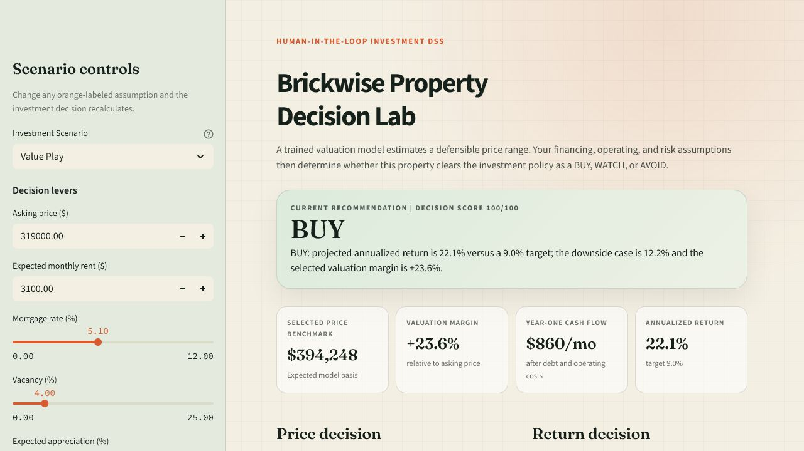
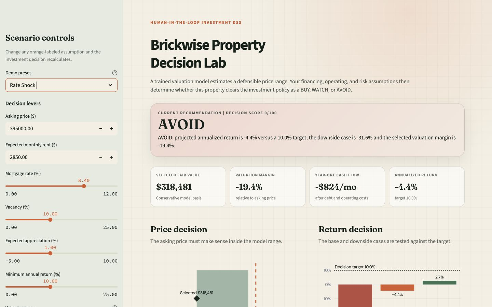

# MSE436 Term Project: Brickwise

Brickwise is a human-in-the-loop decision support system for a small residential property investor deciding whether to **BUY**, **WATCH**, or **AVOID** a candidate listing.

The interface is intentionally load-bearing: property facts change a trained valuation model,
while financing, operating, valuation, and risk controls change the investment recommendation.

Repository: <https://github.com/MSE436-Group18/MSE436-Project>

## Working demo

### Value play: BUY



### Same property under a rate shock: AVOID



## Run locally

Use Python 3.11 or 3.12.

```bash
python -m venv .venv
source .venv/bin/activate
pip install -r requirements.txt
streamlit run app.py
```

The checked-in model artifact makes the demo runnable without a data download. To reproduce
the training pipeline from the original source:

```bash
python scripts/train_model.py
```

## What the system does

1. A gradient-boosted regression model predicts expected sale value from property features.
2. Two quantile models produce a lower and upper valuation estimate for an 80% model range.
3. The user selects a conservative, expected, or optimistic valuation basis.
4. A cash-flow engine projects mortgage payments, rent, vacancy, costs, equity, and sale proceeds.
5. The selected risk policy compares base and downside returns against explicit thresholds.
6. The interface explains exactly why the result is BUY, WATCH, or AVOID.

## Model evidence

The prototype uses the Ames Housing dataset: 2,930 residential sales from 2006-2010. The split
is temporal rather than random so the evaluation better resembles scoring future listings.

| Measure | Result |
| --- | ---: |
| Training rows, 2006-2009 | 2,589 |
| Holdout rows, 2010 | 341 |
| Holdout MAE | $16,022 |
| Holdout R-squared | 0.904 |
| 80% interval coverage | 73.3% |
| Median-price baseline MAE | $52,386 |

Gradient boosting fits this task because housing prices contain non-linear effects and feature
interactions, but the model remains fast enough for live what-if analysis. Its main limitations
are geographic scope, historical prices, and observational data.In a real-world scenario, the system would likely retrain on current local sales and join current rents, vacancy, and financing data to mitigate the risk of any macroeconomic bias present in the current dataset.

## Decision controls

- Model inputs: quality, condition, living area, beds, baths, age, garage, basement,
  neighborhood, building type, and kitchen quality.
- Model settings: valuation basis and an explicit market-index multiplier.
- Scenario inputs: asking price, rent, mortgage rate, down payment, vacancy, rent growth,
  appreciation, maintenance, tax, insurance, and holding period.
- Decision settings: minimum annual return and conservative, balanced, or growth risk policy.

The charts are decision-specific: asking price is shown against the model valuation range, and
downside/base/upside returns are shown against the user's minimum return threshold.

## Verification

```bash
pytest
ruff check .
mypy
```

Tests cover mortgage calculations, scenario sensitivity, recommendation changes, valuation-basis
sensitivity, model output ordering, and property-feature sensitivity.

## Data source

- Dean De Cock, *Ames, Iowa: Alternative to the Boston Housing Data as an End of Semester
  Regression Project*, Journal of Statistics Education 19(3), 2011.
- Original data: <https://jse.amstat.org/v19n3/decock/AmesHousing.txt>
- Paper: <https://doi.org/10.1080/10691898.2011.11889627>
